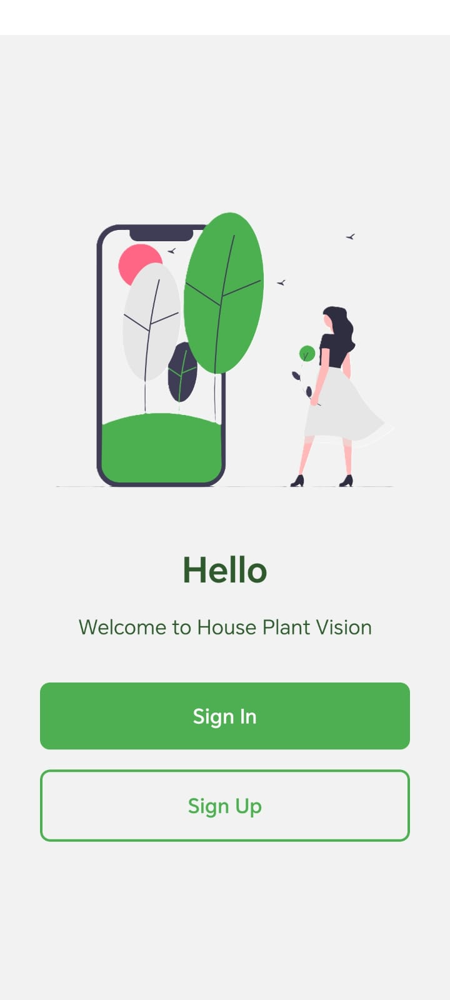
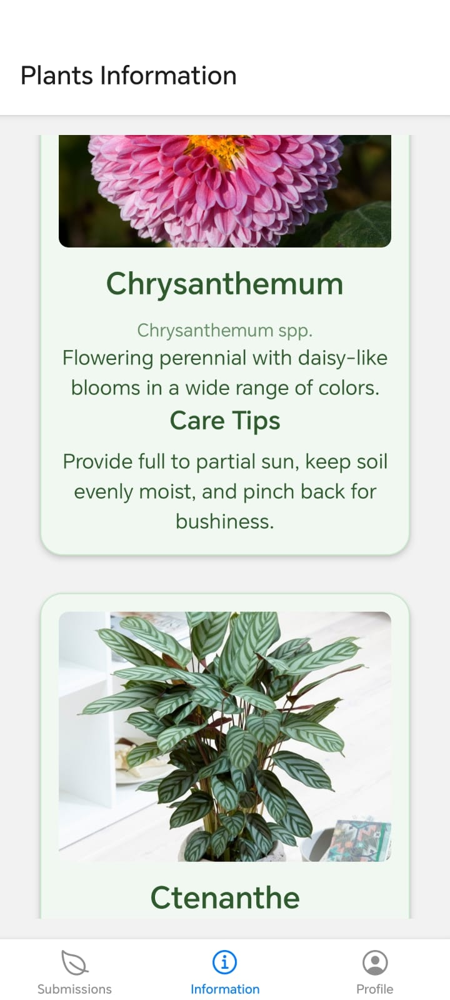
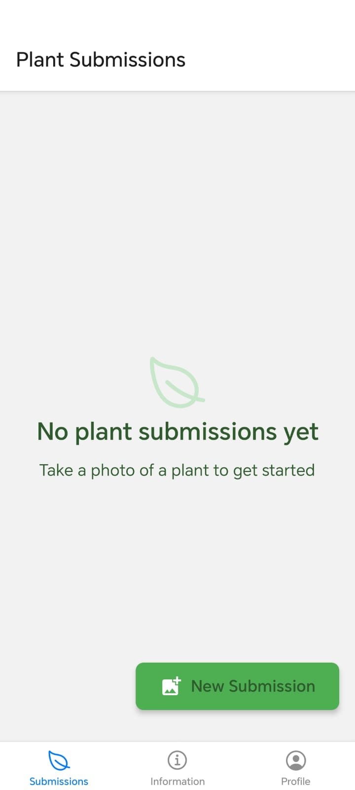
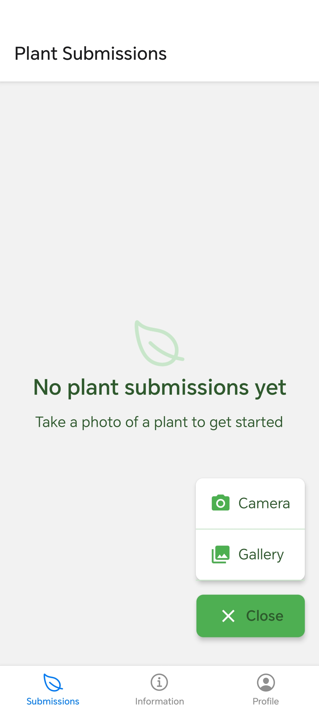
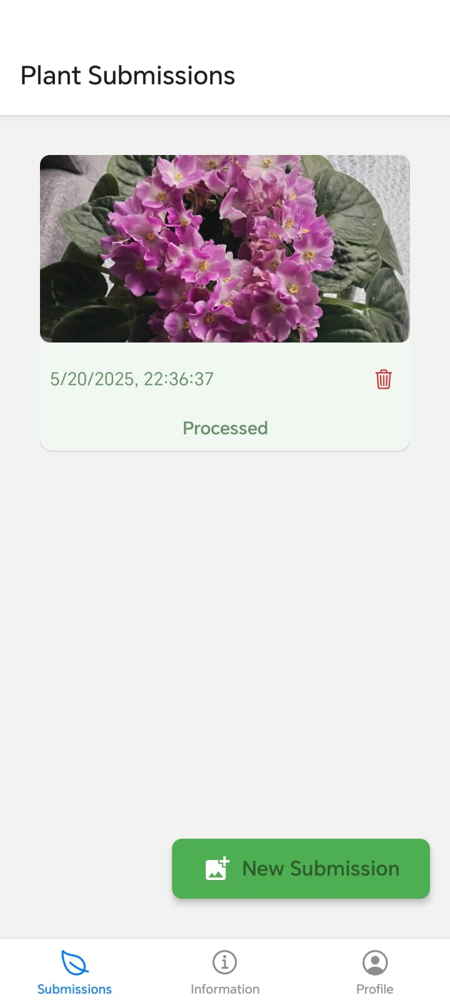
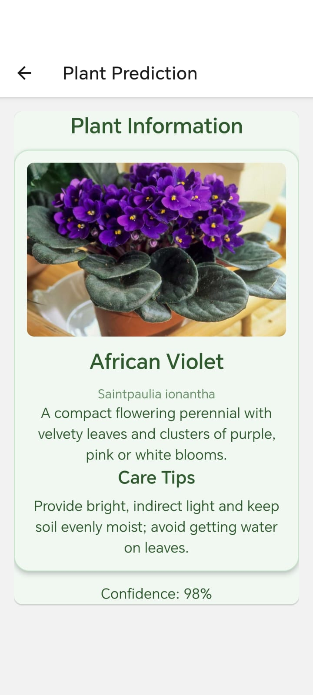

# House Plant Vision App

House Plant Vision is a cross-platform mobile app built with React Native (Expo), powered by a FastAPI backend and a PostgreSQL database. It helps users identify houseplant species from photos with high accuracy using a fine-tuned deep learning model.

## Features
+ Photo-based Identification: Just snap or upload a picture of your houseplant.
+ AI-powered Model: Uses a fine-tuned model for accurate classification.
+ Plant Information: Get care tips, name, scientific name and more.
+ Backend API: FastAPI handles prediction requests and serves data from PostgreSQL.
+ Secure & Scalable: Production-ready backend with modern security practices.

## Screens

  
  
  
  
  
  
  
  
  

